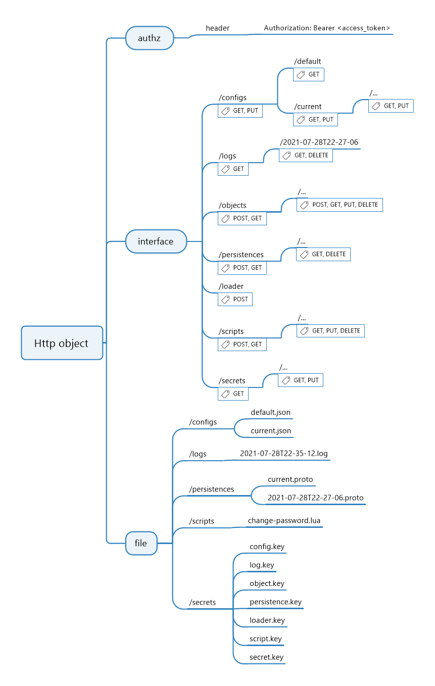

# About

## 1. Overview 

This is the resource about designing. 

## 2. Program Structure 

```plantuml
@startuml
ditaa
+------------------------------------------------------+
|                 interface / log / ...                | framework
+------------------------------------------------------+
| authn / config / object / persistence / script / ... | core module 
+------------------------------------------------------+
@enduml
```

## 3. Mind Map



## 4. 关键依赖

- https://github.com/gin-gonic/gin
- https://github.com/spf13/viper
- https://github.com/yuin/gopher-lua
- https://github.com/protocolbuffers/protobuf