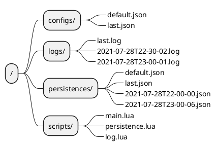

# Semi-Structured Data Service

## 1. Program Structure

```plantuml
@startuml
ditaa
+-----------------------------------------+
|   servie / interface / ...              | framework
+-----------------------------------------+
|   config / persistence / script / log   | core
+-----------------------------------------+
@enduml
```

## 2. Framework

- service
- interface

## 3. Core

- config
- persistence
- script
- log

## 4. File


